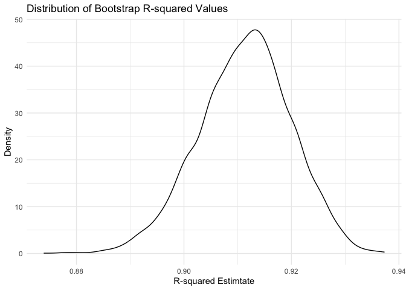
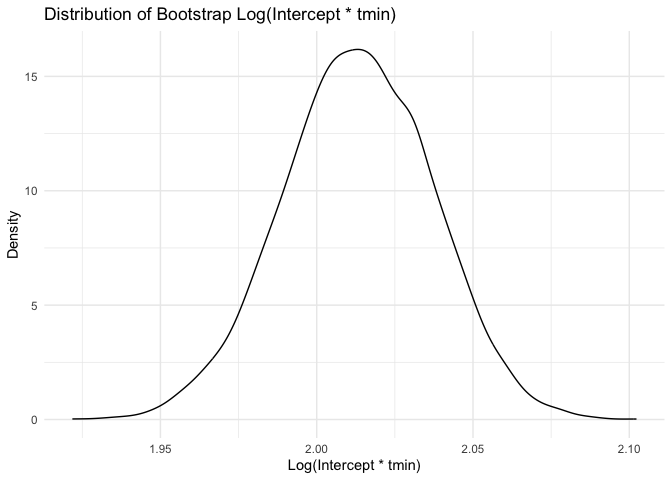
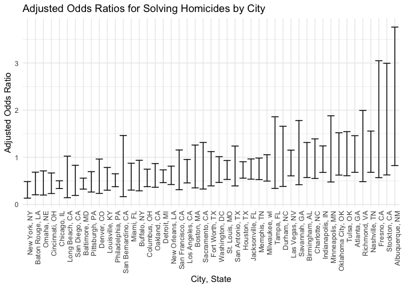
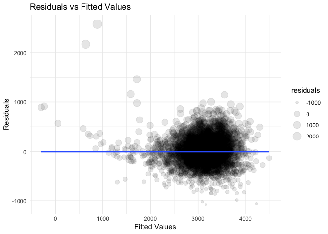
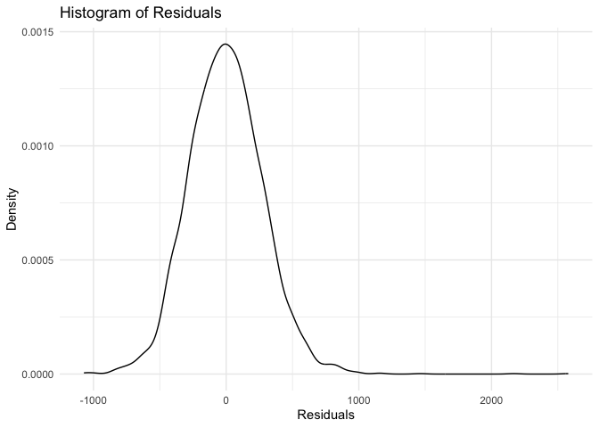
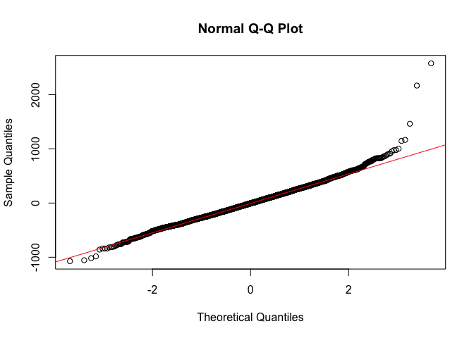
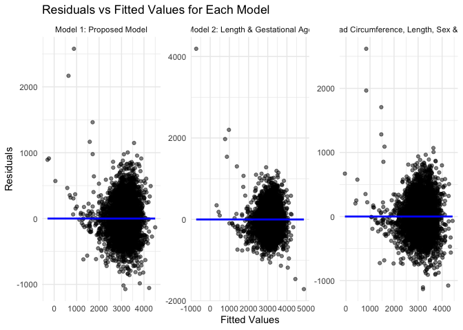
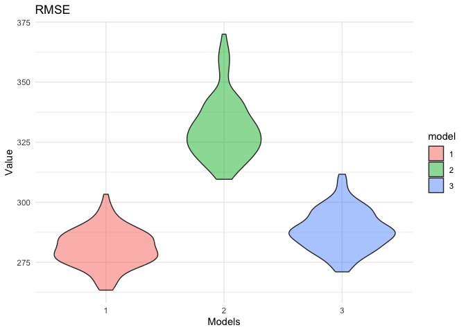

p8105_hw6_HL3859
================
Hanrui Li
2024-12-02

``` r
library(p8105.datasets)
library(tidyverse)
library(dplyr)
library(broom)
library(purrr)
library(ggplot2)
library(modelr)
library(caret)
```

# Problem 1

``` r
weather_df = 
  rnoaa::meteo_pull_monitors(
    c("USW00094728"),
    var = c("PRCP", "TMIN", "TMAX"), 
    date_min = "2017-01-01",
    date_max = "2017-12-31") %>%
  mutate(
    name = recode(id, USW00094728 = "CentralPark_NY"),
    tmin = tmin / 10,
    tmax = tmax / 10) %>%
  select(name, id, everything())
```

    ## using cached file: /Users/helena/Library/Caches/org.R-project.R/R/rnoaa/noaa_ghcnd/USW00094728.dly

    ## date created (size, mb): 2024-09-26 10:17:38.084403 (8.651)

    ## file min/max dates: 1869-01-01 / 2024-09-30

``` r
set.seed(1)

bootstrap_results =
  replicate(5000, {
    boot_sample = weather_df[sample(1:nrow(weather_df), replace = TRUE), ]
    model = lm(tmax ~ tmin, data = boot_sample)
    model_tidy = tidy(model)
    beta_0 = model_tidy$estimate[1]
    beta_1 = model_tidy$estimate[2]
    model_glance = glance(model)
    r_squared = model_glance$r.squared
    log_beta <- log(beta_0 * beta_1)
    c(r_squared = r_squared, log_beta = log_beta)
})

bootstrap_df = data.frame(t(bootstrap_results))
colnames(bootstrap_df) = c("r_squared", "log_beta")

quantile(bootstrap_df$r_squared, probs = c(0.025, 0.975))
```

    ##      2.5%     97.5% 
    ## 0.8936684 0.9271060

``` r
ggplot(bootstrap_df, aes(x = r_squared)) +
  geom_density() +
  labs(title = "Distribution of Bootstrap R-squared Values", 
       x = "R-squared Estimtate", 
       y = "Density") +
  theme_minimal()
```

<!-- -->

The distribution of R-squared values from the bootstrap samples is
approximately normal, centered around 0.91. The density curve suggests
that most of the estimates are concentrated near 0.91, with a slight
tail extending toward lower values. This indicates that the linear model
explains a majority of the variance in the relationship between tmin and
tmax.

``` r
quantile(bootstrap_df$log_beta, probs = c(0.025, 0.975))
```

    ##     2.5%    97.5% 
    ## 1.964949 2.058887

``` r
ggplot(bootstrap_df, aes(x = log_beta)) +
  geom_density() +
  labs(title = "Distribution of Bootstrap Log(Intercept * tmin)", 
       x = "Log(Intercept * tmin)",
       y = "Density") +
  theme_minimal()
```

<!-- -->

The distribution of the log of the product of the intercept and the tmin
variable is also approximately normal, with values centered around 2.0.
The peak density indicates a high concentration of estimates around this
value, and the distribution has a slight tail on the higher end. This
suggests the log-transformed product of the intercept and tmin is
consistent across the bootstrap samples.

# Problem 2

``` r
homicide_df = 
  read.csv("homicide-data.csv", na = c("","NA","Unknown")) |>
  mutate(
    city_state = paste(city, state, sep = ", "),
    victim_age = as.numeric(victim_age),
    solved = case_when(
      disposition == "Closed without arrest" ~ 0,
      disposition == "Open/No arrest" ~ 0,
      disposition == "Closed by arrest" ~ 1)) |>
  select(city_state, victim_age, victim_race, victim_sex, solved) |>
  filter(!(city_state %in% c("Dallas, TX", "Phoenix, AZ", "Kansas City, MO", "Tulsa, AL"))) |>
  filter(victim_race %in% c("White", "Black"))
```

``` r
baltimore_df = 
  homicide_df |>
  filter(city_state == "Baltimore, MD")

glm_model = glm(solved ~ victim_age + victim_sex + victim_race, 
                 data = baltimore_df, 
                 family = binomial)

broom::tidy(glm_model, conf.int = TRUE) |>
  mutate(odds_ratio = exp(estimate),
         CI_lower = exp(conf.low),
         CI_upper = exp(conf.high)) |>
  select(term, estimate, odds_ratio, CI_lower, CI_upper) |>
  knitr::kable(digits = 3)
```

| term             | estimate | odds_ratio | CI_lower | CI_upper |
|:-----------------|---------:|-----------:|---------:|---------:|
| (Intercept)      |    0.310 |      1.363 |    0.976 |    1.911 |
| victim_age       |   -0.007 |      0.993 |    0.987 |    1.000 |
| victim_sexMale   |   -0.854 |      0.426 |    0.324 |    0.558 |
| victim_raceWhite |    0.842 |      2.320 |    1.650 |    3.276 |

``` r
get_or_ci =
  function(city_data) {
    model = glm(solved ~ victim_sex + victim_age + victim_race, 
               data = city_data, 
               family = binomial)
    broom::tidy(model, conf.int = TRUE) |>
  mutate(odds_ratio = exp(estimate),
         CI_lower = exp(conf.low),
         CI_upper = exp(conf.high)) |>
  select(term, estimate, odds_ratio, CI_lower, CI_upper)
}

city_or_ci =
  homicide_df |>
  nest(data = -city_state) |>
  mutate(model_results = map(data, get_or_ci)) |>
  filter(!map_lgl(model_results, is.null)) |>
  unnest(model_results)

city_or_ci |>
  filter(term == "victim_sexMale") |>
  arrange(odds_ratio) |>
  ggplot(aes(x = reorder(city_state, odds_ratio), y = odds_ratio)) +
  geom_errorbar(aes(ymin = CI_lower, ymax = CI_upper)) +
  labs(title = "Adjusted Odds Ratios for Solving Homicides by City",
       x = "City, State",
       y = "Adjusted Odds Ratio") + 
  theme_minimal() +
  theme(axis.text.x = element_text(angle = 90, hjust = 1))
```

<!-- -->

# Problem 3

``` r
birthweight_df =
  read.csv("birthweight.csv") |>
  janitor::clean_names() |>
  mutate(
    babysex = factor(case_when(babysex == 1 ~ "male", 
                               babysex == 2 ~ "female")),
    malform = factor(case_when(malform == 0 ~ "absent", 
                               malform == 1 ~ "present")),
    frace = factor(case_when(frace == 1 ~ "White",
                             frace == 2 ~ "Black",
                             frace == 3 ~ "Asian",
                             frace == 4 ~ "Puero Rican",
                             frace == 8 ~ "Other",
                             frace == 9 ~ "Unknown")),
    mrace = factor(case_when(mrace == 1 ~ "White", 
                             mrace == 2 ~ "Black",
                             mrace == 3 ~ "Asian",
                             mrace == 4 ~ "Puero Rican",
                             mrace == 8 ~ "Other",
                             mrace == 9 ~ "Unknown")))

str(birthweight_df)
```

    ## 'data.frame':    4342 obs. of  20 variables:
    ##  $ babysex : Factor w/ 2 levels "female","male": 1 2 1 2 1 2 1 1 2 2 ...
    ##  $ bhead   : int  34 34 36 34 34 33 33 33 36 33 ...
    ##  $ blength : int  51 48 50 52 52 52 46 49 52 50 ...
    ##  $ bwt     : int  3629 3062 3345 3062 3374 3374 2523 2778 3515 3459 ...
    ##  $ delwt   : int  177 156 148 157 156 129 126 140 146 169 ...
    ##  $ fincome : int  35 65 85 55 5 55 96 5 85 75 ...
    ##  $ frace   : Factor w/ 5 levels "Asian","Black",..: 5 2 5 5 5 5 2 5 5 2 ...
    ##  $ gaweeks : num  39.9 25.9 39.9 40 41.6 ...
    ##  $ malform : Factor w/ 2 levels "absent","present": 1 1 1 1 1 1 1 1 1 1 ...
    ##  $ menarche: int  13 14 12 14 13 12 14 12 11 12 ...
    ##  $ mheight : int  63 65 64 64 66 66 72 62 61 64 ...
    ##  $ momage  : int  36 25 29 18 20 23 29 19 13 19 ...
    ##  $ mrace   : Factor w/ 4 levels "Asian","Black",..: 4 2 4 4 4 4 2 4 4 2 ...
    ##  $ parity  : int  3 0 0 0 0 0 0 0 0 0 ...
    ##  $ pnumlbw : int  0 0 0 0 0 0 0 0 0 0 ...
    ##  $ pnumsga : int  0 0 0 0 0 0 0 0 0 0 ...
    ##  $ ppbmi   : num  26.3 21.3 23.6 21.8 21 ...
    ##  $ ppwt    : int  148 128 137 127 130 115 105 119 105 145 ...
    ##  $ smoken  : num  0 0 1 10 1 0 0 0 0 4 ...
    ##  $ wtgain  : int  29 28 11 30 26 14 21 21 41 24 ...

``` r
missing_summary <- sapply(birthweight_df, function(x) sum(is.na(x)))
print(missing_summary)
```

    ##  babysex    bhead  blength      bwt    delwt  fincome    frace  gaweeks 
    ##        0        0        0        0        0        0        0        0 
    ##  malform menarche  mheight   momage    mrace   parity  pnumlbw  pnumsga 
    ##        0        0        0        0        0        0        0        0 
    ##    ppbmi     ppwt   smoken   wtgain 
    ##        0        0        0        0

No missing data.

**Proposed Regression Model for Birthweight**

``` r
# Hypothesized important factors: gestational age, head circumference, length at birth, 
# mother's weight gain, mother's age, and smoking during pregnancy.
model_1 = lm(bwt ~ gaweeks + bhead + blength + wtgain + momage + smoken + fincome, data = birthweight_df)

# Add predictions and residuals to the dataset
birthweight_df =
  birthweight_df |>
  add_predictions(model_1, "predicted_bwt") |>
  add_residuals(model_1, "residuals")

# Plot residuals against fitted values to assess model fit
birthweight_df |>
  ggplot(aes(x = predicted_bwt, y = residuals)) +
  geom_point(aes(size = residuals), alpha = 0.1) +
  geom_smooth(method = "lm", se = FALSE) +
  labs(title = "Residuals vs Fitted Values", 
       x = "Fitted Values", 
       y = "Residuals") +
  theme_minimal()
```

    ## `geom_smooth()` using formula = 'y ~ x'

<!-- -->

``` r
# Additional diagnostic plots
# Density of residuals to check for normality
birthweight_df |>
ggplot(aes(x = residuals)) +
  geom_density() +
  labs(title = "Histogram of Residuals", 
       x = "Residuals", 
       y = "Density") +
  theme_minimal()
```

<!-- -->

``` r
# Q-Q plot to check if residuals are normally distributed
qqnorm(birthweight_df$residuals)
qqline(birthweight_df$residuals, col = "red")
```

<!-- -->

The residuals vs. fitted values plot shows that while the model fits
most of the data well (with residuals clustered around zero), there are
concerns regarding heteroscedasticity, especially for larger fitted
values. This could indicate that the model fails to capture the
relationship in higher birthweight observations effectively.

The density plot and Q-Q plot indicate that residuals are roughly
normally distributed, but with heavy tails. This means that while the
model captures most of the data adequately, there are extreme
observations that are not well-fitted.

**Compare models**

``` r
# Using length at birth and gestational age as predictors (main effects only)
model_2 = lm(bwt ~ blength + gaweeks, data = birthweight_df)

# Using head circumference, length, sex, and all interactions (including three-way interaction)
model_3 = lm(bwt ~ bhead * blength * babysex, data = birthweight_df)

model_1_df = 
  birthweight_df |>
  mutate(fitted = predict(model_1), 
         residuals = residuals(model_1), 
         model = "Model 1: Proposed Model")

model_2_df = 
  birthweight_df |>
  mutate(fitted = predict(model_2), 
         residuals = residuals(model_2), 
         model = "Model 2: Length & Gestational Age")

model_3_df = 
  birthweight_df |>
  mutate(fitted = predict(model_3), 
         residuals = residuals(model_3), 
         model = "Model 3: Head Circumference, Length, Sex & Interactions")

combined_df = bind_rows(model_1_df, model_2_df, model_3_df)

combined_df |>
ggplot(aes(x = fitted, y = residuals)) +
  geom_point(alpha = 0.5) +
  geom_smooth(method = "lm", se = FALSE, color = "blue") +
  labs(title = "Residuals vs Fitted Values for Each Model", 
       x = "Fitted Values", 
       y = "Residuals") +
  facet_wrap(~ model, scales = "free") +
  theme_minimal()
```

    ## `geom_smooth()` using formula = 'y ~ x'

<!-- -->

``` r
set.seed(123)
cv_data = crossv_mc(birthweight_df, 100)

cv_results = 
  cv_data |>
  mutate(
    model_1 = map(train, ~ lm(bwt ~ gaweeks + bhead + blength + wtgain + momage + 
                                smoken + fincome, data = .x)),
    model_2 = map(train, ~ lm(bwt ~ blength + gaweeks, data = .x)),
    model_3 = map(train, ~ lm(bwt ~ bhead * blength * babysex, data = .x)),
    rmse_1 = map2_dbl(model_1, test, ~ rmse(model = .x, data = .y)),
    rmse_2 = map2_dbl(model_2, test, ~ rmse(model = .x, data = .y)),
    rmse_3 = map2_dbl(model_3, test, ~ rmse(model = .x, data = .y))) |>
  select(starts_with("rmse")) |>
  pivot_longer(
    everything(),
    names_to = "model",
    values_to = "rmse",
    names_prefix = "rmse_") |>
  mutate(model = fct_inorder(model))

cv_results |>
  ggplot(aes(x = model, y = rmse, group = model, fill = model)) +
  geom_violin(alpha = 0.5) +
  labs(title = "RMSE",
       x = "Models",
       y = "Value") +
  theme_minimal()
```

<!-- -->

- Model 1: The narrow spread suggests that Model 1 has more consistent
  prediction accuracy across different splits of the data. Its lower
  central RMSE implies that it generally performs better in terms of
  minimizing prediction error compared to the other models.

- Model 2 (simple): The greater width of the distribution indicates that
  the model’s prediction accuracy is more variable across the different
  cross-validation folds. The higher median RMSE suggests that the
  simpler model with fewer predictors does not fit the data well enough,
  resulting in consistently higher prediction errors. This model lacks
  the complexity needed to effectively capture the factors influencing
  birthweight, leading to poorer predictions.

- Model 3 (complex): While Model 3 incorporates more complexity through
  interaction terms, this does not appear to significantly reduce RMSE
  compared to Model 1. The narrow spread indicates that Model 3 has
  relatively consistent performance, but the central RMSE value being
  similar or slightly higher than Model 1 suggests that the added
  interaction terms may not have provided much practical improvement,
  and possibly led to overfitting.

Overall, Model 1 (my model) is the best model among the three, providing
a good trade-off between complexity and performance. It achieves the
lowest RMSE while maintaining consistency across the cross-validation
folds.
